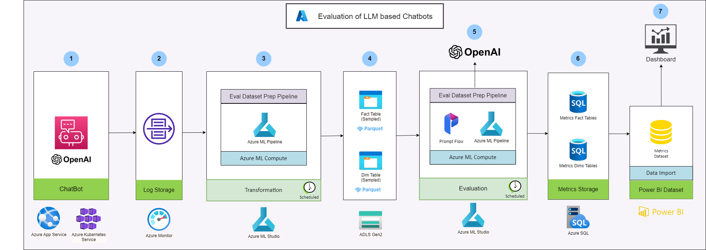

# Evaluation of LLM based ChatBots

## Overview

### Business Problem

LLMs can produce sophisticated, coherent and persuasive language on any topic using their general knowledge, but most of their real-world applications require them to answer questions based on the context given in the prompt and their previous training.

Customers who develop and use applications such as ChatBots for answering product or service-related questions would need to evaluate the performance of these applications from both Business and Data science perspectives to enhance them further.

The area of LLM assessing LLM based applications is new but evolving quickly, however there are no common framework or platform to conduct evaluations at a large scale for retail/commerce ChatBots.

### Business Value

This solution (along with the working codebase) and the related pattern here provide a high-level approach to understand LLM evaluations, including the data model, data pipelines to process the input data, and datastore to store the evaluation metrics for Self-service visualization. The solution can be a catalyst for e-commerce/retail chatbot use cases, but it can also be adapted for other domains with minor changes based on the needs.

Likewise, the solution can be used as an Example asset both in ISE and MCAPS more generally to show the relevance and usefulness of LLM evaluations for different domains, its advantages for business and data science, adaptability and scalability of the solutions etc. 

## Features
The asset is a summary of learnings and extractions from the implementation of “Conversational commerce chatbot Evaluation Framework” for a large e-commerce customer based in India.

This asset has a reference frontend UI that simulates a chat interface which generates conversations which then persisted in the data stores for further evaluations. The reference implementations have the following features:

**NOTE:** Several features might be re-usable as-is, however, there could be modifications or extensions needed based on the use cases.

* Data Model for LLM Evaluation
* Data Transformation Pipeline for processing application logs
* LLM Evaluation Pipeline for generating evaluation metrics at scale
* Visualization of evaluation metrics in PowerBI
* Automation of infrastructure deployment using IaC

## PostProd Evaluation

### Architecture (PostProd Evaluation)

The architecture of the solution is as follows:

The architecture consists of the following components:

1. **ChatBot** - The application that is handling the chat conversations, built using LLMs.
1. **Log Storage** - The storage for the chat logs, generated by the ChatBot application. This contains the raw chat logs for each turn in the conversation and the LLM calls made by the ChatBot.
1. **Transformation Pipeline** - The pipeline that processes the raw chat logs and generates the data model for the evaluation.
1. **Evaluation Data Store** - The storage for the processed chat logs, containing the data model for the evaluation. The data will be stored as Parquet files.
1. **Evaluation Pipeline** - The pipeline that processes the data model and generates the evaluation metrics by calling the LLM. In this step, Prompt Flow is used at scale to generate the evaluation metrics.
1. **Evaluation Metrics Store** - The storage for the evaluation metrics generated by the Evaluation Pipeline. The data store will be a structured store, such as a SQL database.
1. **Visualization** - The visualization tool that will be used to visualize the evaluation metrics. This could be a BI tool, such as PowerBI.

### Getting Started

#### QuickStart (PostProd Evaluation)
Refer to the [QuickStart](./postprod-eval/QuickStart.md) guide to get started with the solution.

#### Prerequisites

- Azure Subscription
- Development Environment
    - Azure CLI
    - Python 3.11
    - Conda
    - Visual Studio Code
    - Power BI Desktop (for visualization)

#### Infrastructure Deployment

The infrastructure for the solution can be deployed using the provided Infrastructure as Code (IaC) templates. For more details refer to the [Infrastructure Deployment](./postprod-eval/docs/01_Infrastructure.md) guide.

#### Framework Deployment

The framework can be deployed using the provided deployment scripts. For more details refer to the [Framework Deployment](./postprod-eval/docs/02_Deployment.md) guide.

### Demo

A quick demo of the solution can be found in the [Demo](./postprod-eval/docs/04_Demo.md) guide.

### Understanding the Framework

The framework is designed to be modular and extensible. The framework consists of the following components:

1. [Data Model](./postprod-eval/docs/images/data_model.png) - The data model for the evaluation, containing the chat logs and the evaluation metrics.
1. [Azure SQL](./postprod-eval/azuresql) - The Azure SQL scripts for creating the database and tables for storing the evaluation metrics as per the data model.
1. [Sample Chatbot](./postprod-eval/sample-chatbot) - A sample chatbot application that generates the chat logs for demonstration purposes.
1. [Framework Source](./postprod-eval/src/llmevalgrader) - The source code for the framework, containing python modules for the data transformation pipeline and evaluation pipeline.
1. [Framework Deployment](./postprod-eval/azureml) - The deployment and execution scripts for the framework, containing the Azure ML pipelines for the data transformation and evaluation pipelines.
1. [Dashboards](./postprod-eval/dashboards) - The PowerBI dashboard for visualizing the evaluation metrics.

**NOTE:** The more detailed information about the framework can be found in the [Developer Guide](./postprod-eval/docs/03_Developer_Guide.md).

### Extending the Framework

The framework can be extended in several ways to support different use cases. For more details refer to the [Extending the Framework](./postprod-eval/docs/05_Extending_the_Framework.md) guide.

### Resources

- [Azure Machine Learning](https://azure.microsoft.com/en-us/products/machine-learning)
- [Prompt Flow](https://microsoft.github.io/promptflow/)
- [Azure OpenAI](https://azure.microsoft.com/en-in/products/ai-services/openai-service)
- [Azure SQL](https://azure.microsoft.com/en-in/products/azure-sql/database)
- [ADLS Gen2](https://learn.microsoft.com/en-us/azure/storage/blobs/data-lake-storage-introduction)
- [Azure Monitor](https://learn.microsoft.com/en-us/azure/azure-monitor/overview)
- [PowerBI](https://www.microsoft.com/en-us/power-platform/products/power-bi/)

## PreProd Evaluation

Go to [PreProd Evaluation](./preprod-eval/weather-chatbot/README.md) for more details.

## Contributors

- [Balakrishna Akuleti](https://github.com/balakrishnaakuleti)
- [Ivan Shaporov](https://github.com/ivan-shaporov)
- [Jeff Ding](https://github.com/jding05)
- [Linda M Thomas](https://github.com/lindamthomas)
- [Prabal Deb](https://github.com/prabdeb)
- [Priya Bhimjyani](https://github.com/priya-27)
- [Sarah Sexton](https://github.com/SarahSexton)
- [Scott Grosenick](https://github.com/ScoGroMSFT)
- [Sean Miller](https://github.com/seanmiller168)
- [Sugandh Mishra](https://github.com/meghdivya)
- [Zikra Toure](https://github.com/zitoure)
