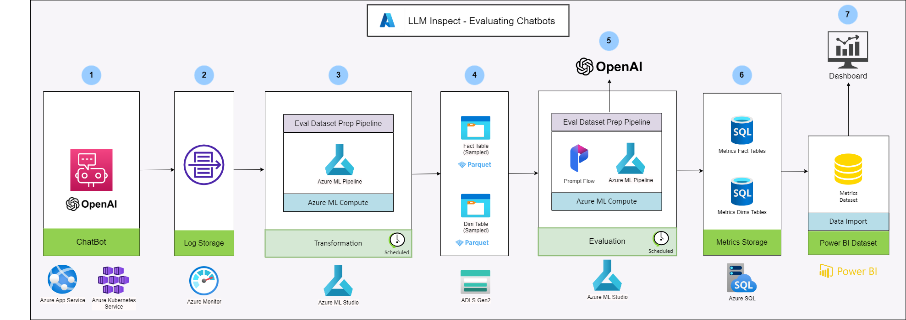
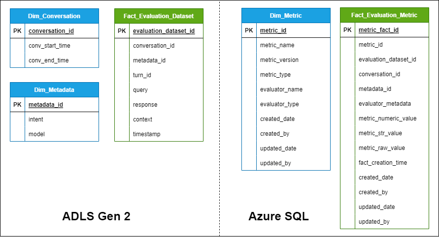

# Evaluation of LLM based conversational chat bot post-production

## Introduction

One of the challenges that organizations face when deploying LLM based Chat Bot applications in production is to evaluate their performance and impact on the business outcomes. LLMs are complex and data-hungry models that are trained with open world data to achieve high accuracy and fluency. However, accuracy and fluency are not enough to measure the success of an LLM based application, as they do not capture the relevance, usefulness, and appropriateness of the generated text for the specific domain and task. Moreover, LLMs may exhibit biases, inconsistencies, and errors that can affect the user experience and trust. 

This application is an evaluation system that can monitor the quality and behaviour of the LLM based application in production and provide feedback and insights to improve it and justify the investment.

This evaluation system would be able to:

- Define and track relevant metrics and KPIs that reflect the business objectives and user satisfaction of the LLM based application.

- Collect and analyse data from various sources, such as user feedback, logs, surveys, benchmarks, and tests, to measure the performance and impact of the LLM based application on the business outcomes.

- Identify and diagnose issues, gaps, and risks that may arise in the production environment, such as data drift, model degradation, bias, toxicity, security issues or compliance violations, and suggest actions to mitigate them.

- Provide recommendations and guidance to optimize and enhance the LLM based application, such as data augmentation, model fine-tuning, domain adaptation, or post-editing.

### Benefits to Business Team

- This LLM based evaluation solution can help the business team to measure the quality and impact of their LLM based applications on various dimensions, such as accuracy, relevance, fluency, coherence, and customer satisfaction.

- The evaluation solution can provide actionable insights and feedback to the business team on how to improve their LLM based applications, such as identifying the strengths and weaknesses, the best and worst cases, and the areas of improvement.

- The evaluation solution can also enable the business team to compare and benchmark their LLM based applications with other alternatives or competitors, and to track their progress and performance over time.

- The evaluation solution can thus support the business team in making informed and data-driven decisions, enhancing their confidence and trust in their LLM based applications, and achieving their business goals and KPIs.

### Benefits to Engineering and Data Science Team

The LLM based evaluation solution enables the engineering and data science team to:

- Measure and improve the quality and effectiveness of their LLM based applications using evaluation metrics and feedback.

- Identify the strengths and weaknesses of their models, and fine-tune or retrain them accordingly.

- Optimize the user experience, satisfaction, and engagement with their LLM based applications.

- Increase the conversion rate and buying intent of their potential customers.

## How to setup?

Please follow below steps to setup this LLM based evaluation system.

1. The first step involves creation of infrastructure on Azure Cloud using IaC(infrastructure) as code scripts. Follow [this document](<TODO-link>) to setup the infrastrucutre.
2. Now that infrastructure is ready, required tables are to be created in the created Azure SQL. Open the query editor of the created Azure SQL resource on Azure Portal and execute below scripts, to create tables necessary.
    - [DIM_METRIC](../azuresql/DIM_METRIC.sql)
    - [FACT_EVALUATION_METRIC](../azuresql/FACT_EVALUATION_METRIC.sql)

## Developer Experience

[Developer guide](<TODO>) has the detailed documentation required.

[Deployment guide](<TODO>) has the details on the deployment of the AML pipelines.

## Architecture

The deatiled architecture is shown in the below diagram:

## DataModel

The deatiled data model is shown in the below diagram:

## Pipelines

### Transformation

### Evaluation

## Dashboard
