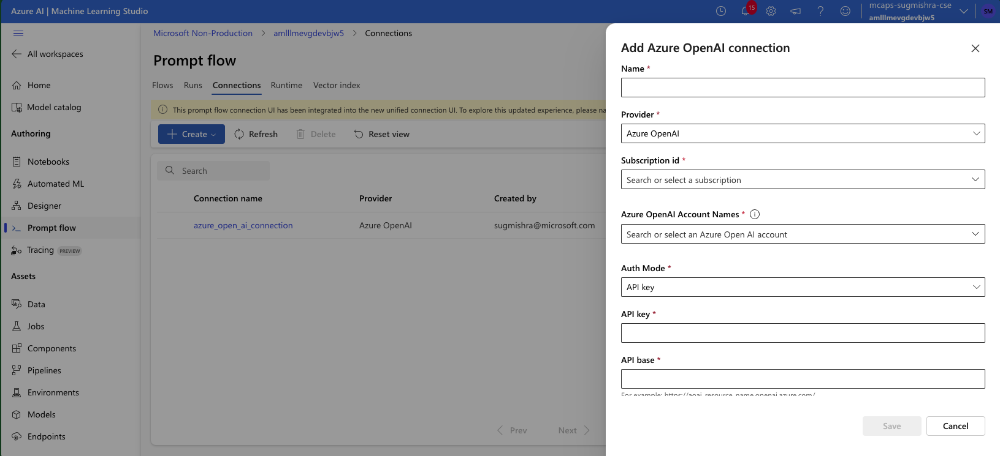

# Deployment

Deploying the application involves several stages:

1. Running the chatbot application.
2. Deploying the transformation and evaluation pipeline.
3. Executing the transformation pipeline.
4. Executing the evaluation pipeline.

## Prerequisites  
- Ensure successful completion of infrastructure deployment.
- [Developer Guide](03_Developer_Guide.md) is followed to setup the conda environment

## Application Deployment Details

### Populate Environment Variables 
1. Rename `.env.template` in the `deploy` [folder](../azureml/pipeline/deploy/) to `.env` and update the values.  
2. Rename `.env.template` in the `sample-chatbot` [folder](../sample-chatbot/) to `.env` and update the values.

### Sample Chatbot
For details on the chatbot, refer to [this document](../sample-chatbot/README.md).  
To run chatbot, Navigate to the [sample-chatbot](../sample-chatbot/) directory and execute
`streamlit run app.py`
Conversation logs are available in Application Insights.

### Deploy Pipelines
Navigate to [deploy](../azureml/pipeline/deploy/) folder and execute following commands
```
python deploy_transformation_pipeline.py
python deploy_evaluation_pipeline.py
```
This deploys batch endpoints as well as schedules for both pipelines.

### Run Transformation Pipeline
The pipeline can be executed either from the AML Jobs Schedule or by triggering the scripts in the [run](../azureml/pipeline/run/) folder
```
python run_transformation_pipeline.py  --transformation_start_date "2024/05/10"  --transformation_end_date "2024/05/13"
```
The pipeline reads chatbot logs from the AML Log Analytics workspace and performs necessary transformation and sampling. It then writes the fact dataset and related dim tables to the gold zone of the ADLS Gen2 container.

### Add OpenAI connection in promptflow

1. Goto AML workspace in Azure portal and select your workspace.
2. Click on `Promptflow` and select the `Connections` tab.
3. Click on `Create` button and select the `OpenAI` connection option.
4. Fill in the required details and click on `Create`.

### Run Evaluation Pipeline
The pipeline can be executed either from the AML Jobs Schedule or by triggering the scripts in the [run](../azureml/pipeline/run/) folder
```
python run_evaluation_pipeline.py  --evaluation_start_date "2024/05/10 00:00"  --evaluation_end_date "2024/05/13 23:59"
```
This pipeline reads the fact dataset from the gold zone, prepares the data, and sends it to the OpenAI GPT model for evaluation (turn_relevance). The GPT output is further formatted and written into the `FACT_EVALUATION_METRIC` SQL table. The `DIM METRIC` table is also populated during execution.

## Troubleshooting

### Endpoint Name
Ensure batch endpoint names are unique within an Azure region.
