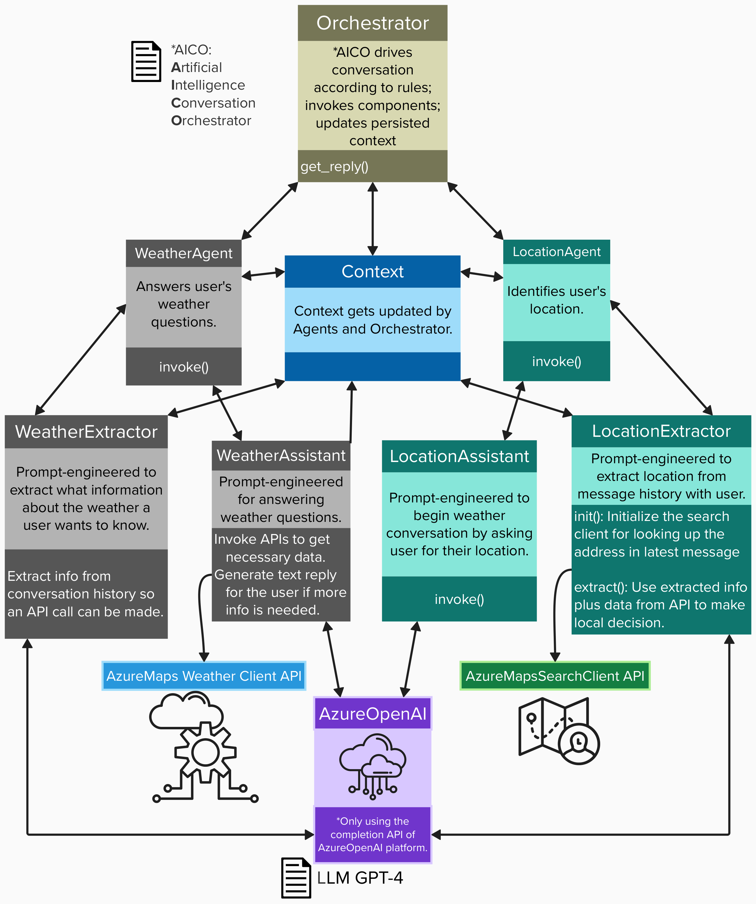
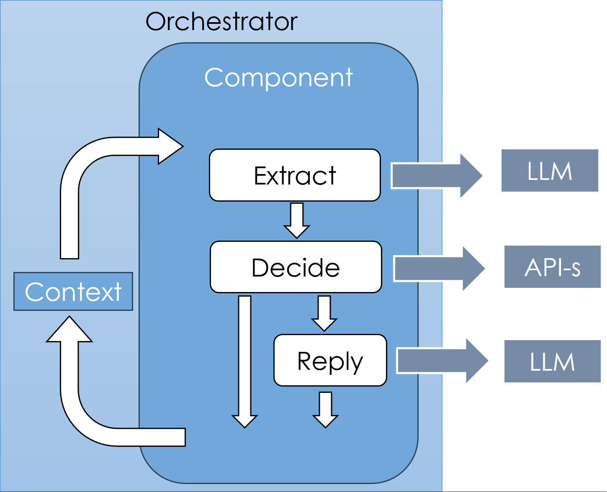

# How this app works

The main purpose of this app is to demonstrate a Retrieval Augmented Generation (RAG) chatbot that has been grounded in a specific API. This code sample uses the Azure maps and weather API.

In this Python app's code, there are two agents: **Location** and **Weather**. They communicate with one **Orchestrator**. The agents use external APIs to ground the information.

- The **Location** agent talks to the user about their location of interest.
- The **Weather** agent answers user's questions about the weather at the location.
- The **Orchestrator** controls the flow of the conversation by invoking an agent according to the conversation state. The Orchestrator integrates with APIs, and dispatches the tasks to AI agents, according to its business rules. It drives the conversation with users and provides personalized recommendations. 

On every HTTP request with a message from a user, the Orchestrator receives the message and the context for the given conversation. The context stores the history of the previous messages in this conversation as well as the knowledge accumulated so far. Having that, the Orchestrator can invoke appropriate agents according to the business rules. 

An agent, or, "component," solves one specific task. For example: Talk to the user about their location and extract geographical attributes required by internal APIs. 

Each agent implements the "Extract, Decide, Reply" pattern, which consists of 3 consecutive steps:

- **Extract** step extracts the necessary information from the
conversation state.
- **Decide** step decides what to do next.
- **Reply** step generates a reply for the user, or generates a question if more information is required.

#### Additional information about "EDR":

1. **Extract**: In the Extract step, the LLM is queried with a prompt that contains instructions on what information is needed, and the message history. The extractor is supposed to parse the text returned from the LLM and convert it to a structured object, like a Python dictionary. 

2. **Decide**: Having accumulated knowledge and new knowledge, the agent can Decide what to do next. The agent can invoke internal APIs and update the context according to the business rules. If the task is completed, the agent returns the control back to the Orchestrator. 

3. **Reply**: If more information is needed for the current task, then the Assistant part of the agent queries the LLM with instructions to prepare a Reply to the user. The reply is then returned to the Orchestrator and sent to the user, completing the incoming HTTP request. 

#### While the user interacts with the chatbot, the following things happen:

1. The user query is sent to the OpenAI GPT-4o model to detect intent of the query. The intent should have something to do with providing a "location" to the chatbot.
2. Based on the intent, the chatbot will call the respective Prompt and make another call to the OpenAI GPT-4o model to generate the response. Essentially there will be two calls to the OpenAI GPT-4o model for each user query.
3. The response generated by the OpenAI GPT-4o model is displayed in the chatbot interface or console.
4. The chatbot will also display the previous conversation in the chatbot interface for a given conversation.

#### Data logging 
The following data is logged for each conversation at different stages:

1. **Conversation Data**: For each *query*, the following data is logged:
    1. `User Query` The query entered by the user.
    2. `Chatbot Response` The response that user gets from the chatbot.
    3. `Conversation ID` The ID of the conversation.
    4. `Turn ID` The ID of the turn in the conversation.
2. **LLM Data**: For each *OpenAI GPT-4o model call*, the following data is logged:
    1. `User Query` The query entered by the user.
    2. `Intent` The intent detected by the OpenAI GPT-4o model.
    3. `LLM Response` The response generated by the OpenAI GPT-4o model.
    4. `Conversation ID` The ID of the conversation.
    5. `Turn ID` The ID of the turn in the conversation.
    6. `Model` The name of the model used for the call.
    